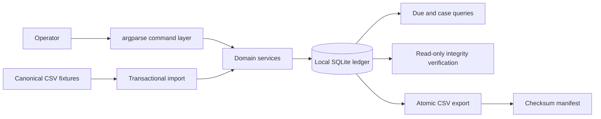

```text
 █████╗ ███████╗███████╗███████╗████████╗    ██████╗ ███╗   ███╗ █████╗
██╔══██╗██╔════╝██╔════╝██╔════╝╚══██╔══╝    ██╔══██╗████╗ ████║██╔══██╗
███████║███████╗███████╗█████╗     ██║       ██████╔╝██╔████╔██║███████║
██╔══██║╚════██║╚════██║██╔══╝     ██║       ██╔══██╗██║╚██╔╝██║██╔══██║
██║  ██║███████║███████║███████╗   ██║       ██║  ██║██║ ╚═╝ ██║██║  ██║
╚═╝  ╚═╝╚══════╝╚══════╝╚══════╝   ╚═╝       ╚═╝  ╚═╝╚═╝     ╚═╝╚═╝  ╚═╝

██╗     ███████╗██████╗  ██████╗ ███████╗██████╗
██║     ██╔════╝██╔══██╗██╔════╝ ██╔════╝██╔══██╗
██║     █████╗  ██║  ██║██║  ███╗█████╗  ██████╔╝
██║     ██╔══╝  ██║  ██║██║   ██║██╔══╝  ██╔══██╗
███████╗███████╗██████╔╝╚██████╔╝███████╗██║  ██║
╚══════╝╚══════╝╚═════╝  ╚═════╝ ╚══════╝╚═╝  ╚═╝
```

# Asset RMA Ledger

[](https://github.com/ericjaytech/asset-rma-ledger/actions/workflows/ci.yml)

Asset RMA Ledger is a local command-line application for tracking equipment sent to vendors for repair, replacement or assessment. It gives small IT teams a controlled RMA lifecycle, deadline reporting and an append-only case history without requiring a server or cloud account.

Version `0.1.0` is an alpha release for evaluation and portfolio demonstrations. It stores operational records in one local SQLite database and has no runtime dependencies.

## What it does

- Tracks vendors, warranty terms, assets, serial numbers and one active RMA case per asset.
- Records vendor response, authorisation, dispatch, receipt, return and closure milestones.
- Calculates elapsed-time response and resolution deadlines from frozen case terms.
- Preserves case changes as append-only, SHA-256 hash-chained events.
- Reports overdue and upcoming deadlines.
- Imports canonical CSV snapshots transactionally, with a full dry-run option.
- Exports deterministic CSV tables and a checksum manifest.
- Replays case history and verifies database, schema, event-chain and projection integrity.

## Architecture and data flow



The command layer validates operator input. Domain services enforce lifecycle
rules and write the current projections plus append-only case events in one
transaction. Reporting and verification remain read-only. Export stages a complete
bundle before publishing it to a new directory.

## Requirements

- Python 3.11 or later
- Linux, macOS or Windows
- A local filesystem for the SQLite database

Network shares and concurrent multi-user editing are not supported.

## Install

Install the alpha release with `pipx`:

```bash
pipx install "git+https://github.com/ericjaytech/asset-rma-ledger.git@v0.1.0"
asset-rma-ledger --version
```

For development:

```bash
git clone https://github.com/ericjaytech/asset-rma-ledger.git
cd asset-rma-ledger
python3 -m venv .venv
. .venv/bin/activate
python -m pip install -e .
asset-rma-ledger --version
```

## Complete synthetic workflow

Create a new ledger. Existing files are never overwritten.

```bash
asset-rma-ledger --database demo-ledger.db init
```

Register a synthetic vendor and asset:

```bash
asset-rma-ledger --database demo-ledger.db vendor add \
  --key northstar --name "Northstar Repairs" \
  --response-sla-hours 8 --resolution-sla-hours 120

asset-rma-ledger --database demo-ledger.db asset add \
  --tag LAB-0042 --serial SYNTH-A1B2C3 --type laptop \
  --manufacturer ExampleCo --model ProBook-14 \
  --warranty-vendor northstar --warranty-end 2027-06-30
```

Open and progress an RMA case through the normal return lifecycle:

```bash
asset-rma-ledger --database demo-ledger.db case open \
  --case RMA-DEMO-001 --asset LAB-0042 --vendor northstar \
  --opened-at 2026-09-01T09:00:00Z --by demo

asset-rma-ledger --database demo-ledger.db case vendor-response \
  RMA-DEMO-001 --at 2026-09-01T12:15:00Z \
  --vendor-reference SYNTH-88421 --by demo

asset-rma-ledger --database demo-ledger.db case authorise \
  RMA-DEMO-001 --at 2026-09-01T13:00:00Z --by demo

asset-rma-ledger --database demo-ledger.db case dispatch \
  RMA-DEMO-001 --at 2026-09-02T10:00:00Z \
  --carrier "Example Carrier" --tracking SYNTH-OUT-001 --by demo

asset-rma-ledger --database demo-ledger.db case vendor-received \
  RMA-DEMO-001 --at 2026-09-03T11:00:00Z --by demo

asset-rma-ledger --database demo-ledger.db case outcome \
  RMA-DEMO-001 --at 2026-09-05T15:00:00Z \
  --outcome repaired --by demo

asset-rma-ledger --database demo-ledger.db case return-dispatch \
  RMA-DEMO-001 --at 2026-09-06T09:30:00Z \
  --carrier "Example Carrier" --tracking SYNTH-RET-001 --by demo

asset-rma-ledger --database demo-ledger.db case return-received \
  RMA-DEMO-001 --at 2026-09-07T14:00:00Z --by demo

asset-rma-ledger --database demo-ledger.db case close \
  RMA-DEMO-001 --at 2026-09-07T14:15:00Z --by demo
```

Inspect the result and verify the ledger:

```bash
asset-rma-ledger --database demo-ledger.db case show RMA-DEMO-001 --history
asset-rma-ledger --database demo-ledger.db due --within 48h \
  --as-of 2026-09-02T09:00:00Z
asset-rma-ledger --database demo-ledger.db verify
```

Example terminal output from that synthetic workflow:

```text
Reference: RMA-DEMO-001
Asset: LAB-0042
Vendor: northstar
Status: returned
Opened at: 2026-09-01T09:00:00Z
Response due: 2026-09-01T17:00:00Z
Resolution due: 2026-09-06T09:00:00Z

Verified ledger: 6 checks, 1 cases, 9 events.
```

## CSV import and export

Imports require exact canonical columns and create new records only. A dry run parses and validates the complete file inside a transaction, then rolls it back:

```bash
asset-rma-ledger --database demo-ledger.db import vendors vendors.csv \
  --dry-run --by migration
asset-rma-ledger --database demo-ledger.db import assets assets.csv \
  --dry-run --by migration
asset-rma-ledger --database demo-ledger.db import cases cases.csv \
  --dry-run --by migration
```

Case import reconstructs the minimum standard history represented by each snapshot and marks generated payloads with `source: csv_import`. It does not import arbitrary event history.

Export publishes five CSV files and `export_manifest.json` atomically to a new directory:

```bash
asset-rma-ledger --database demo-ledger.db export \
  --output-dir ledger-export --as-of 2026-09-07T15:00:00Z
```

See [Data model and file contracts](docs/data-model.md) for the lifecycle, canonical CSV columns and export contents.

The repository includes small, invented import fixtures in `examples/fixtures/`.
They contain no operational or employer data and are suitable for dry-run demos.

## Security and privacy boundary

> [!WARNING]
> The database and exports can contain serial numbers, vendor references, tracking numbers and case notes. Store and share them as sensitive operational data.

- The application does not provide encryption, authentication, access control or key management. Use approved encrypted local storage and operating-system permissions.
- It does not read environment variables, discover user identities, open stored URLs, make network requests or invoke shell commands.
- Operator aliases are supplied explicitly through `--by`; use non-personal team aliases where appropriate.
- SQL statements are fixed and parameterised. CSV imports are limited to 100 MiB and 250,000 rows.
- Spreadsheet formula prefixes are escaped in CSV exports, and export files are staged privately before publication.
- Event hashes and database triggers detect accidental edits, omissions and reordering. They do not prove authenticity against someone who controls both the database and application code.

Run `verify` before relying on an export or after moving a database:

```bash
asset-rma-ledger --database demo-ledger.db verify
```

Verification is read-only. A failure exits with code `5` and identifies the failed check without printing event payload values.

## Limitations

- The ledger is local and single-user; network filesystems and concurrent writers
  are unsupported.
- Deadlines use elapsed hours, not business calendars, holidays or vendor opening
  hours.
- Hash chaining detects accidental history changes but is not a digital signature
  and cannot defeat an attacker who controls both the database and application.
- Imports create new records from exact canonical columns. They do not reconcile
  arbitrary CMDB exports or import complete historical event streams.
- The tool does not encrypt data, contact vendors, track parcels, overwrite files
  or apply remediation.

## Command and exit-code contract

```bash
asset-rma-ledger --help
asset-rma-ledger --version
asset-rma-ledger import vendors --help
```

| Exit code | Meaning |
| --- | --- |
| `0` | Command or dry-run completed |
| `2` | Invalid argument, CSV contract or operation request |
| `3` | Referenced domain record or transition was invalid |
| `4` | Database or destination conflict |
| `5` | Integrity verification failed |

## Development

Install the development tools and run the release gates:

```bash
python -m pip install --group dev
python -m ruff format --check .
python -m ruff check .
python -m pytest
python -m build
```

The project uses Python's standard library at runtime: `argparse`, `csv`, `datetime`, `hashlib`, `json`, `sqlite3` and `uuid`.
